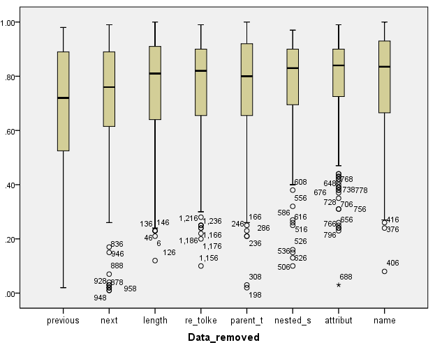
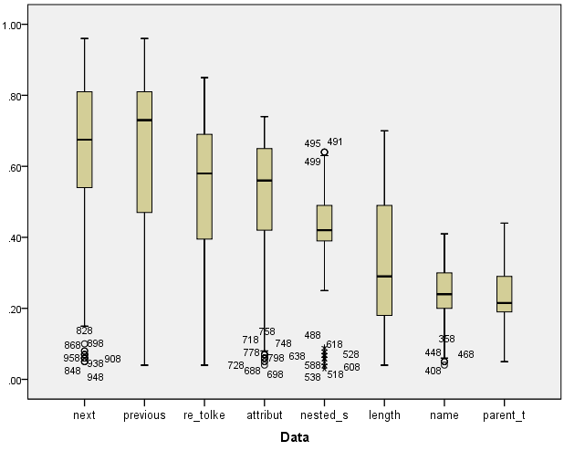
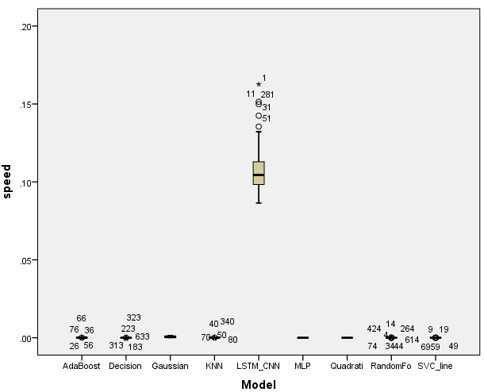
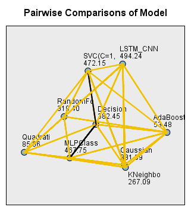

# Machano-soup
Text classification of parsed tokenized HTML. Visually displayed text from websites are extracted as navigable string using (using Python's Beautiful soup 4 package) and represented as matrices containing ordered data extracted from the navigable string object. Data such as the HTML tags following the text being classified, it's parents tags, the length of the text, and the occurrence of regular expressions are used to classify it.

> machanosoup.py

Comparing classifiers to extract data from a specific website: https://santemontreal.qc.ca/population/coronavirus-covid-19/depistage-covid-19-a-montreal/

Process: The website's HTML was scraped and parsed with beautiful soup. The pages text items are manually classified into 6 categories: (nothing, the clinic's name, wether the clinic accepts walk-in or is appointment based, opening hours, address and the contact number or email). 

# Material and methods
Different classifiers were trained on the obtained data. A machine learning (LSTM-CNN) based approach was developed and compared with common classifiers as implemented in Sklearn (python package). All classifiers were trained on a pseudo randomly selected subset of the manually labeled data. To assess the model's performance, the macro average F1 score was considered on the remaining portion of the data not used for training (~ 33 %). 

The data representing the text being classified consisted in a matrix of numbers pertaining to the text's navigable string object. More precisely the amount of characters it consisted of, the amount of parent tags, the text's HTML tag, the ordered parent HTML tags, wether or not the parent tags hed defined classes or ids, the tags which were located "next" and "previous", and wether or not certain regular expressions occured in the text itself.

Classifiers were repeatedly trained and assessed using a 0.33 validation/test split. The mean F1 macro_avg score was compared using a series of Mann-Whitney tests as implemented by SPSS.

## Statistical approach
All observations were independently collected. The dependent variable is continuous (F1 macro_avg). The Kruskal-Wallis test was chosen as a non-parametric alternative to an ANOVA because data for the depend variable (F1 macro score) violated assumptions of normality as
determined by Shapiro-Wilk’s (1965) test of normality and did not have homogeneous variance as determined by Levene's (Olkin, 1960) test of equal variance.

Post hoc pair-wise comparison of the Kruskal-Wallis test (a series of Mann-Whitney tests as implemented by SPSS (Bergmann et al., 2000)) revealed that significant differences we're observed. They are depicted in Figure 1.5.

# Results

**Figure 1.1:** Benchmarking parsed HTML classifiers based on F1-macro average. Classifiers taken from documentation [here](https://scikit-learn.org/stable/auto_examples/classification/plot_classifier_comparison.html#sphx-glr-auto-examples-classification-plot-classifier-comparison-py) with the addition of a KNN. A LSTM-CNN model made using Tensorflow was developed.

**Figure 1.2:** Assessing the relevance of the data by looking at the decrease in classifier performance after removal.

**Figure 1.3:** Assessing the relevance of the data by looking at vector input to train classifiers.

**Figure 1.4:** Execution speed of classifier performing a prediction based on 100 executions

<!-- **Figure 1.5:** Significant performance upgrade? -->

**Figure 1.5:** Pairwise comparison showing rank for each classifier for balanced dataset. When imbalanced dataset (all class 0 null cases were kept) was used, MLP ~ SVC ~ LSTM with MLP performing the best.

<!-- 

**Figure 2.1:** F1 macro scores for validation dataset using 7 by 22 matrix (all but the data appearing on the x axis). LSTM-CNN 0.91 ~ SVM 0.89 > KNN 0.74.

**Figure 2.2:** F1 macro scores for validation dataset of 1 by 22 vector classifiers (Only the data appearing on the x axis). LSTM-CNN 0.51 ~ KNN 0.50 > SVM 0.42. -->

# Discussion
The custom LSTM-CNN network investigated performed better than other classifiers as implemented by SKLEARN. The execution speed was many orders of magnitude higher as seen in Figure 1.4. Even when training data are in the hundreds of samples, performant classifiers can be trained using the latest machine learning techniques.

In the case when a single vector is used, the LSTM-CNN network performs much betters for the previous and next data vectors.

For this type of task, rule based systems are still standard practice for a variety of reasons (refer to rulebased.py). The methodology developed in machanosoup.py we're implemented to demonstrate the methodologies employed in properly assessing machine learning models (validation and training split) and comparing them. It also lays the groundwork involved in creating valid/meaningful data representations for parsed HTML using beautifulsoup4. Using this approach to scrape non domain specific data will require concerted effort and is the long term goal for this project.

<!-- # LSTM-CNN architecture -->

# Next steps
Checking the effect of labeling error.

Assessing the effect of hyperparameter tuning.
- Tried for svc but did not find any better model

Assessing the effect of early stopping.

Comparing the most important features from various sites.

Do it for another website

MLP classifier performed best when soup was not pruned. Remained similar to LSTM-CNN and 

# References

Bergmann, R., P. J. M. S. Will, and J. Ludbrook. 2000. Different outcomes of the Wilcoxon-MannWhitney test from different statistics packages. The American Statistician 54(1):72-77

Pan W et al. 2017. Optimizing the Multiclass F-Measure Via Biconcave Programming. Proceedings - IEEE International Conference on Data Mining, ICDM, 1101-1106, pp. 1101–1106. doi: 10.1109/ICDM.2016.184.

Shapiro, S. S., and M. B. Wilk. 1965. An analysis of variance test for normality (complete
samples). Biometrika 52(3-4):591-611.

Olkin, I. 1960. Contributions to probability and statistics; essays in honor of Harold Hotelling. Stanford studies in mathematics and statistics, 2. Stanford University Press, Stanford, Calif.