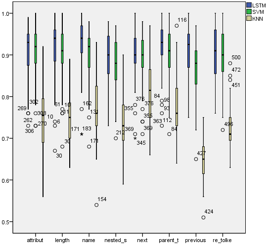

# Machano-soup
Text classification approach based on regular expressions and html structure.

> machanosoup.py

Comparing classifiers to extract data from a specific website: https://santemontreal.qc.ca/population/coronavirus-covid-19/depistage-covid-19-a-montreal/

Process: The website's HTML was scraped and parsed with beautiful soup. The pages text items are manually classified into 6 categories: (nothing, the clinic's name, wether the clinic accepts walk-in or is appointment based, opening hours, address and the contact number or email). 

Three different classifiers were trained to extract the various classes from the parsed text: A machine learning LSTM based approach, a SVC and a KNN classifier. The latter two were implemented using SKLEARN, and the machine learning approach used Tensorflow Keras. The quality of the model was assessed using it's macro F1 score on a portion of the data set aside for validation (was not included in training dataset) The datasets were always created from the same entry of items. The input given to the classifier consisted in creating a 7 by 22 matrix from the navigable string object; more precisely the amount of characters it consists of, the amount of parent tags, the text's class, the ordered parent tags, wether or not the parents tags have defined class or ids, the tags which are located "next", ... "previous" and wether or not certain regular expressions occur in the text element being classified.

**Figure 1:** F1 macro scores for validation dataset using 7 by 22 matrix (all but the data appearing on the x axis). SVM 0.89 > LSTM 0.75 > KNN 0.75

As we can see from the graph SVM was the best performing method.

**Figure 2:** F1 macro scores for validation dataset of 1 by 22 vector classifiers (Only the data appearing on the x axis). KNN 0.48 > SVM 0.42 > LSTM 0.33

<!-- # LSTM-CNN architecture -->

