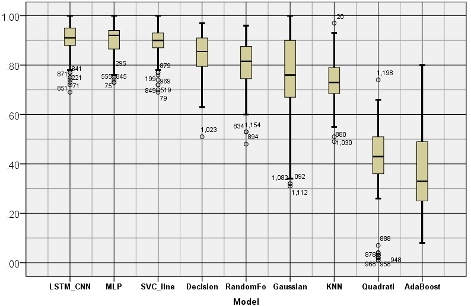
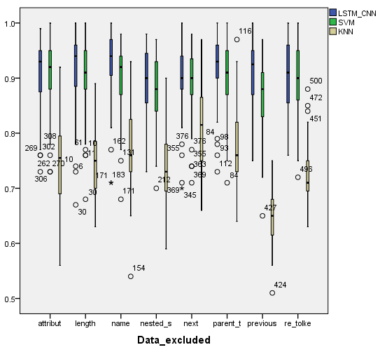
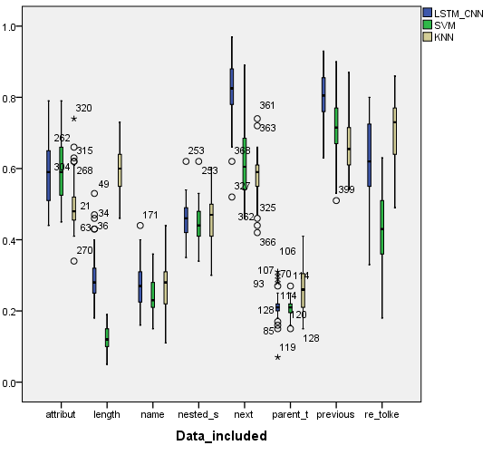

# Machano-soup
Text classification approach based on regular expressions and html structure.

> machanosoup.py

Comparing classifiers to extract data from a specific website: https://santemontreal.qc.ca/population/coronavirus-covid-19/depistage-covid-19-a-montreal/

Process: The website's HTML was scraped and parsed with beautiful soup. The pages text items are manually classified into 6 categories: (nothing, the clinic's name, wether the clinic accepts walk-in or is appointment based, opening hours, address and the contact number or email). 

# Material and methods
Different classifiers were trained to on parsed text data. A machine learning (LSTM-CNN) based approach was developed and compared with the common classifiers available in SKLEARN (python package). All classifiers were trained on manually labeled data. To assess the model's performance, the macro average F1 score was considered. A random portion (~ 33 %) of the classified text was set aside prior to training the classifiers for validation. The input given to the classifier consisted in creating a matrix from the navigable string object; more precisely the amount of characters it consists of, the amount of parent tags, the text's HTML tag, the ordered parent HTML tags, wether or not the parents tags have defined classes or ids, the tags which are located "next", ... "previous", and wether or not certain regular expressions occur in the text element being classified.

# Results

**Figure 1.1:** Benchmarking parsed HTML classifiers based on F1-macro average. Classifiers taken from documentation [here](https://scikit-learn.org/stable/auto_examples/classification/plot_classifier_comparison.html#sphx-glr-auto-examples-classification-plot-classifier-comparison-py) with the addition of a KNN. A LSTM-CNN model made using Tensorflow was developed.

**Figure 1.2:** Assessing the relevance of the data by looking at the decrease in classifier performance after removal.

**Figure 1.2:** Execution speed of classifier performing a prediction based on 100 executions

<!-- 

**Figure 2.1:** F1 macro scores for validation dataset using 7 by 22 matrix (all but the data appearing on the x axis). LSTM-CNN 0.91 ~ SVM 0.89 > KNN 0.74.

**Figure 2.2:** F1 macro scores for validation dataset of 1 by 22 vector classifiers (Only the data appearing on the x axis). LSTM-CNN 0.51 ~ KNN 0.50 > SVM 0.42. -->

# Discussion
The custom LSTM-CNN network investigated performed better than other investigated classifiers. The execution speed was many orders of magnitude higher as seen in Figure 1.2. To note even when sample amount are in the hundreds performant classifiers can be trained using the latest machine learning techniques.

In the case when a single vector is used, the LSTM-CNN network performs much betters for the previous and next vectors.
<!-- # LSTM-CNN architecture -->

# Next steps
Checking the effect of labeling error

Comparing the most important features from various sites.

# References
